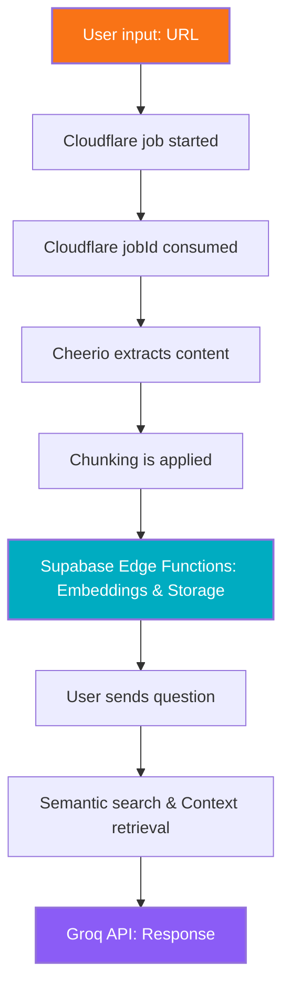

# 🚀 Crawldflare.AI
## Advanced Vector Ingestion & RAG pipeline


Crawldflare.AI is a tool designed to index documentation pages using Cloudflare's new ``/crawl`` endpoint, store the data in a Supabase vector database, and allow natural language queries via Groq.

- Take a look at the deployment here: https://crawldflare.vercel.app/

## 🛠️ Tech Stack & Libraries
- **Frontend:** ``Next.js 15`` (App Router), ``Tailwind CSS v4``.
- **Backend:** Calls to Cloudflare's ``/crawl`` endpoint, formatted using ``Cheerio`` and served via ``Next.js API Routes`` + ``Supabase Edge Functions``.
- **Database:** ``Supabase`` (PostgreSQL + pgvector).
- **IA:** ``Groq Cloud`` (LLM) via API call.

## 📦 Installation & Setup

### 1. Clone the repository
```bash
git clone https://github.com/ori0nis/cloudflare-docs-crawler
cd cloudflare-docs-crawler
```

### 2. Set up environment variables
```bash
cp .env.example .env.local
```

### 3. Set up the database in a Supabase project (2 steps):

### 🥇 Step 1 - execute the SQL setup code and activate vector extension.
```SQL
-- Activate pgvector
create extension if not exists vector;

-- Table "Datasets" (improves Groq's context, also used to display available datasets in frontend)
create table datasets (
  id uuid primary key default gen_random_uuid(),
  url_base text unique not null,
  created_at timestamp with time zone default now()
);

-- Table "Chunks" (vector fragments of crawled data)
create table chunks (
  id uuid primary key default gen_random_uuid(),
  dataset_id uuid references datasets(id),
  content text,
  embedding vector(1536), -- Adjust depending on the model you're using. Native size is 384 (a humble and free API, indeed)
  metadata jsonb
);
```

### 🥈 Step 2 - create ``match_chunks`` function. This function is vital for Crawldflare's context supply to Groq.
```SQL
create or replace function match_chunks (
  query_embedding vector(384),
  match_threshold float,
  match_count int,
  filter_dataset text
)
returns table (
  id uuid,
  content text,
  url text,
  title text,
  similarity float
)
language plpgsql
as $$
begin
  return query
  select
    chunk.id,
    chunk.content,
    chunk.url,
    chunk.title,
    1 - (chunk.embedding <=> query_embedding) as similarity
  from chunk
  where 1 - (chunk.embedding <=> query_embedding) > match_threshold
    and (filter_dataset is null or chunk.dataset = filter_dataset)
  order by similarity desc
  limit match_count;
end;
$$;
```

### 4. Install & Execute
```bash
npm install
npm run dev
```

## 💡 How it works
1. **Ingestion:** URL is sent. Cloudflare Browser Rendering extracts its contents.
2. **Vectorization:** Content is fragmented via proprietary ``Cheerio`` processing and chunking functions, applied first through the service, and then through the Supabase Edge Functions.
3. **User query:** User sends query, relevant fragments are retrieved via semantic match and Groq response is generated.

_To avoid timeouts, all processing calls are asyncronous and called via polling in the frontend._



## 📂 Folder structure
- ``/src/app``: ``Next.js`` app logic + API Routes.
- ``/src/components``: Interface components (``IngestForm``, ``AskGroq``).
- ``/supabase``: Edge Function setup and logic.

## 📄 License
This project is open source and available under the ``MIT License``.

## 🤝 Contributing
Contributions, issues, and feature requests are welcome! Contact me for more info, and stay up to date with the issues page.

Happy crawling 🐌!
